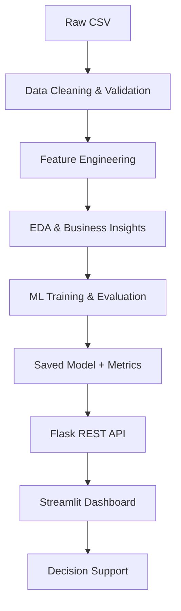

# Telecom Customer Churn — Decision Support Dashboard

<div align="center">


IBM SkillsBuild Data Analytics with AI Academic Internship  
BharatCares × AICTE

</div>

## Project Overview

This project turns a historical telecom customer dataset into a decision-support workflow that moves from raw data to a usable business dashboard:

RAW DATA → CLEAN DATA → EDA → INSIGHTS → PREDICTION → DASHBOARD → DECISION

The solution follows a business-oriented logic:

- KPI → What is happening?
- Trend / Pattern → How is it changing or varying?
- Driver → Why / which factors?
- Risk → What could go wrong?
- Action → What should be considered?

The system combines data preparation, exploratory analysis, churn prediction, explainable customer-level output, and a four-page Streamlit dashboard to support retention prioritisation and customer risk review.

## Problem Statement

Telecom operators need a practical way to identify customers who are likely to leave before churn occurs. A generic retention approach can be expensive and inefficient, while a lack of prioritisation can allow at-risk customers to slip away silently.

This project builds a churn-risk framework that:

- analyses historical customer behaviour and service patterns,
- scores active customers with churn probability,
- classifies risk into Low / Medium / High tiers,
- highlights risk drivers and business opportunities,
- exposes the logic through a Flask API and a Streamlit dashboard.

## Dataset

- Dataset: IBM Telco Customer Churn dataset
- Customers: 7,043
- Original fields: 21
- Target variable: Churn
- Churn rate: approximately 26.5%
- Data type: historical, static observational dataset

The project also calculates business-oriented metrics such as monthly recurring revenue (MRR) at risk and active customer revenue exposure. These are derived from the project’s scored data and should be interpreted as operational indicators, not guarantees of real-world telecom outcomes.

## Data Preprocessing and Feature Engineering

The preprocessing in `src/preprocessing.py` is a real data-cleaning pipeline, not a placeholder workflow.

Key steps implemented:

- Missing `TotalCharges` values handled by converting the column to numeric and setting blank values to `0.0` only where `tenure == 0`.
- Redundant service categories such as `No internet service` and `No phone service` were normalised to `No`.
- `SeniorCitizen` was recoded from `0/1` to `No/Yes` for consistent binary labeling.
- Duplicate checks and validation were performed.
- Outliers were checked using the IQR method and kept rather than removed, because the values were treated as valid business amounts/durations.
- No unnecessary rows were deleted.
- Feature engineering added the following variables used in the modelling workflow:
  - `n_protection_services`
  - `n_streaming_services`
  - `auto_pay`
  - `tenure_group`

These features capture aspects of service bundle depth, payment behavior, and customer lifecycle stage.

## Exploratory Data Analysis

The project performs EDA on the static customer dataset, including churn patterns across customer tenure and other relevant service attributes. The analysis is not time-series analysis because the dataset does not contain a timestamp-based panel dimension.

Important observed patterns in the project include:

- Contract type is strongly associated with churn risk.
- Early tenure is associated with higher churn than later tenure.
- Internet service type is associated with churn differences.
- Payment method is associated with churn differences.
- Protection and support services are associated with different churn outcomes.
- Other variables in the dataset, such as `SeniorCitizen`, `Partner`, `Dependents`, and bundle-related features, are also part of the churn analysis.

The EDA is designed to explain patterns in the data rather than claim causation.

## Machine Learning Workflow

The project implements a binary classification workflow for churn prediction.

### Model pipeline

- Binary classification problem: `Churn` = Yes / No
- Stratified 80/20 train-test split
- Scikit-learn pipeline with preprocessing and estimator
- Models compared:
  - Logistic Regression
  - Random Forest
  - Gradient Boosting
  - DummyClassifier baseline
- 5-fold Stratified Cross-Validation
- Evaluation using ROC-AUC and PR-AUC
- Model selection based on cross-validated performance and simplicity
- Logistic Regression selected as the final model
- Decision threshold tuned to 0.32 using out-of-fold training predictions only
- Customer-level churn probability and risk tier generation

### Verified model metrics

| Model                      | CV ROC-AUC | Test ROC-AUC |
| -------------------------- | ---------: | -----------: |
| Baseline (DummyClassifier) |      0.500 |        0.500 |
| Logistic Regression        |     0.8462 |       0.8426 |
| Random Forest              |     0.8435 |       0.8435 |
| Gradient Boosting          |     0.8483 |       0.8460 |

The final tuned Logistic Regression model (threshold = 0.32) reported:

| Metric    | Value |
| --------- | ----: |
| Accuracy  | 0.759 |
| Precision | 0.534 |
| Recall    | 0.730 |
| F1        | 0.617 |
| ROC-AUC   | 0.843 |
| PR-AUC    | 0.635 |

These figures are presented as the project’s actual results and should be interpreted as a reasonable classification model on this static dataset, not as a perfect or universal predictor.

## Risk Scoring and Model Logic

The final model assigns each customer a churn probability and then converts it into a risk tier.

Risk logic used in the project:

- Low: probability < 0.30
- Medium: 0.30 ≤ probability < 0.60
- High: probability ≥ 0.60

The dashboard and API use these tiers for prioritising retention attention.

## Business KPIs and Dashboard Metrics

The project calculates the following operational metrics from the scored dataset:

| Metric                       |       Value |
| ---------------------------- | ----------: |
| Customers                    |       7,043 |
| Active customers             |       5,174 |
| Churned customers            |       1,869 |
| Churn rate                   |      26.54% |
| High-risk active customers   |         294 |
| Medium-risk active customers |         936 |
| Active MRR                   | ₹316,985.75 |
| High-risk active MRR         |  ₹24,179.85 |
| Medium-risk active MRR       |  ₹68,749.10 |
| MRR at risk                  |  ₹92,929.10 |
| Total MRR                    | ₹456,116.60 |

## Explainable Predictions

The application provides customer-level outputs including:

- churn probability,
- predicted churn status,
- risk tier,
- feature-level explanation.

For the logistic model, the explanation compares each customer’s value against a reference sample and highlights the feature contributions that increase or decrease the predicted churn risk. This supports interpretability and business review without implying that any one factor is proven to be causal.

## Business Insights and Recommendations

The project includes an insight engine in `src/insights.py` that generates business-facing findings from the scored customer base. These findings are structured as:

- Fact
- Insight
- Implication
- Recommended action for consideration

Important distinction:

- Observed data patterns are based on historical associations in the dataset.
- Model predictions are generated from the trained classifier.
- Business recommendations are retention actions for consideration rather than guaranteed interventions.

The project is careful not to assign causation from correlation alone.

## Streamlit Dashboard

The dashboard is implemented as a four-page app in `frontend/app.py` and exposes a structured decision-support workflow.

### Pages

1. Executive Overview
   - summarises churn rate, revenue exposure, and key business KPIs.

2. Trend & Driver Analysis
   - shows churn patterns across tenure and customer segments.
   - compares important churn drivers such as contract type, internet service, and payment method.

3. Predict a Customer
   - accepts a customer profile and returns churn probability, risk tier, and explainable feature contributions.

4. Risk & Recommendations
   - displays ranked risk and retention opportunities based on the scored data.

## Flask REST API

The backend API is implemented in `backend/app.py` and exposes the project’s operational endpoints.

| Endpoint      | Purpose                                                                                                     |
| ------------- | ----------------------------------------------------------------------------------------------------------- |
| `/health`     | Returns API health and model-loading status.                                                                |
| `/model_info` | Returns model metadata, selected model, decision threshold, risk cutoffs, features, and input schema.       |
| `/dataset`    | Returns dataset summary, metadata, churn rate, and a sample of scored data.                                 |
| `/kpis`       | Returns project KPIs, including churn metrics and revenue exposure metrics.                                 |
| `/insights`   | Returns business insights generated from the scored dataset.                                                |
| `/predict`    | Accepts a customer payload and returns churn probability, risk tier, predicted churn flag, and explanation. |

These endpoints provide the application layer used by the dashboard and allow the model to be consumed programmatically.

## Architecture



## Technologies

The project uses the following technologies actually present in the implementation:

- Python
- Pandas
- NumPy
- Scikit-learn
- Matplotlib
- Seaborn
- Plotly
- Flask
- Streamlit
- Joblib
- Requests

## Project Structure

```text
telco_churn_ai/
├── README.md
├── requirements.txt
├── backend/
│   └── app.py
├── data/
│   ├── raw/
│   │   └── Telco-Customer-Churn.csv
│   └── processed/
│       ├── telco_clean.csv
│       └── telco_scored.csv
├── frontend/
│   └── app.py
├── model/
│   ├── churn_model.joblib
│   ├── feature_importance.csv
│   └── model_metrics.json
├── notebooks/
│   └── Chirag_TelcoChurnAnalysis.ipynb
├── report_images/
├── src/
│   ├── __init__.py
│   ├── evaluation.py
│   ├── inference.py
│   ├── insights.py
│   ├── preprocessing.py
│   └── train_model.py
├── tools/
│   ├── build_notebook.py
│   ├── build_report.js
│   └── package.json
├── Chirag_ProjectReport.docx
├── .gitignore
└── .venv/
```

## Installation

Preferred environment used for the project:

```bash
conda create -n telco_churn python=3.12 -y
conda activate telco_churn
pip install -r requirements.txt
```

## How to Run

### 1) Start the Flask backend

```bash
python backend/app.py
```

The API runs locally at:

- Flask API: http://127.0.0.1:5000
- Health check: http://127.0.0.1:5000/health

### 2) Start the Streamlit dashboard

```bash
streamlit run frontend/app.py
```

The dashboard runs locally at:

- Streamlit: http://localhost:8501

These are local development URLs and are not public deployment endpoints.

## Requirements

The project dependency list is defined in `requirements.txt` and includes the actual packages used by the implementation:

```text
pandas==3.0.2
numpy==2.4.4
scikit-learn==1.8.0
matplotlib==3.10.8
seaborn==0.13.2
flask==3.1.3
streamlit==1.64.0
plotly==7.1.0
joblib==1.5.3
requests==2.33.1
```

## Verification and Testing

The project was verified locally in the project environment using the actual packages and API workflow.

Verified checks included:

- package / import verification for `pandas`, `numpy`, `scikit-learn`, `flask`, `streamlit`, `plotly`, `joblib`, and `requests`
- Flask server startup
- `/health` endpoint response
- `/kpis` endpoint response
- `/model_info` endpoint response
- `/insights` endpoint response
- `/dataset` endpoint response
- `/predict` endpoint response
- Streamlit dashboard startup
- prediction API test returning HTTP 200
- model artifact loading verification

The project does not include a formal automated test suite; verification was performed through direct environment and API checks during project development.

## Notebook and Report

The project includes a Jupyter notebook workflow and a project report.

- Notebook: `Chirag_TelcoChurnAnalysis.ipynb`
- Report: `Chirag_ProjectReport.docx`

The notebook contains the analysis and model-development workflow used to clean, analyse, evaluate, and score the dataset.

## Limitations

This project has several realistic limitations that should be kept in mind:

- The dataset is historical and static; it does not provide real-time customer behavior.
- There is no direct usage-minute or traffic information in the data.
- There is no complaint-history or support ticket dataset in the current project.
- There is no competitor pricing information in the dataset.
- Observed relationships are associations, not proven causal effects.
- Model performance depends on the dataset and feature set used for training.
- Retention recommendations require business validation before implementation.

## Future Scope

The following areas are suitable for future extension, but are not current functionality:

- real-time data integration,
- model monitoring and drift detection,
- additional customer behavior signals,
- deeper explainability and counterfactual analysis,
- automated retraining,
- cloud deployment,
- CRM integration,
- A/B testing of retention strategies.

## Project Deliverables

The project includes:

- Python source code
- Jupyter notebook
- `requirements.txt`
- Streamlit dashboard
- Flask REST API
- Project report
- README documentation

## Author

Chirag  
B.E. Artificial Intelligence & Data Science  
Srinivas Institute of Technology, Mangaluru  
Visvesvaraya Technological University (VTU)

## Conclusion

This project follows a complete decision-support pipeline for telecom customer churn analysis: from raw customer data to cleaning, validation, feature engineering, EDA, model comparison, evaluation, risk scoring, explainable prediction, and dashboard-level business insight. The final output is a practical churn-risk system designed to support retention prioritisation rather than provide a simplistic static report alone.
